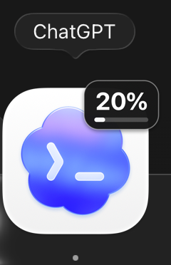
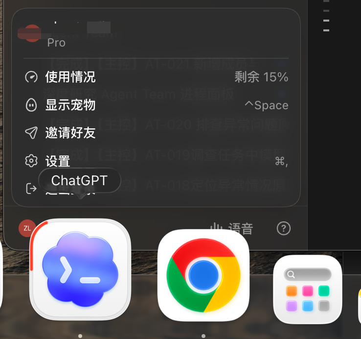
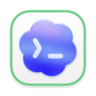
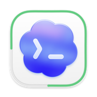
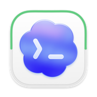
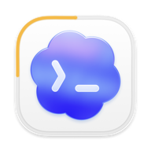
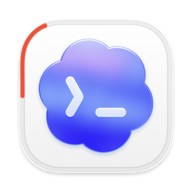

# Codex Dock Quota Badge

把 Codex 主使用限额的真实剩余百分比，直接画进 macOS 正式 Codex 的 Dock 图标。提供数字版和线框版两种显示模式。

## 效果

### 数字版

直接显示剩余百分比数字，并用下方余量条辅助查看。



### 线框版

通过贴合图标外沿的连续线框显示剩余额度，每经过一个角代表 25%。`≥50%` 为绿色、`20%–49%` 为黄色、`<20%` 为红色。



不同剩余额度下的线框状态：

| 100% | 75% | 50% | 25% | 15% |
| --- | --- | --- | --- | --- |
|  |  |  |  |  |

Dock 放大或缩小时，图标与额度显示会作为一个整体变化。两种模式共用同一套安装和额度读取能力，安装后可以随时互相切换。

> 当前是公开测试版，只支持 `compatibility/releases.tsv` 中明确列出的 Codex 版本。它会修改并重新签名本机 Codex App；安装前自动保存可校验的官方原版备份。

## 使用方式

### 如果你想使用数字版

复制下面这段话，交给你的 Codex：

```text
请帮我安装这个项目提供的 Codex Dock 剩余额度角标，首次使用数字版：

https://github.com/Katao123/codex-dock-quota-badge

请克隆仓库，进入仓库后完整阅读并遵守 AGENTS.md，使用 scripts/install-numeric.sh 完成环境检查、备份、安装、重启和验收。不要重新实现另一套方案，不要强行支持不兼容版本。需要 macOS 权限时再告诉我具体点哪里。

最终只能留下一个正式 Codex；必须显示真实余量、同步缩放、没有红色未读角标，并保留恢复官方原版的能力。

完成后请告诉我当前余量和验证结果，并明确说明：以后我只需对 Codex 说“请切换成线框版”，它就会自动切换。
```

### 如果你想使用线框版

复制下面这段话，交给你的 Codex：

```text
请帮我安装这个项目提供的 Codex Dock 剩余额度角标，首次使用线框版：

https://github.com/Katao123/codex-dock-quota-badge

请克隆仓库，进入仓库后完整阅读并遵守 AGENTS.md，使用 scripts/install-ring.sh 完成环境检查、备份、安装、重启和验收。不要重新实现另一套方案，不要强行支持不兼容版本。需要 macOS 权限时再告诉我具体点哪里。

最终只能留下一个正式 Codex；必须沿图标外沿显示真实余量，正确使用绿、黄、红三档颜色，同步缩放，没有红色未读角标，并保留恢复官方原版的能力。

完成后请告诉我当前余量和验证结果，并明确说明：以后我只需对 Codex 说“请切换成数字版”，它就会自动切换。
```

完整版本见 [COPY_PROMPT.zh-CN.md](COPY_PROMPT.zh-CN.md)。

## Codex 会复用什么

| 文件 | 作用 |
| --- | --- |
| `scripts/preflight.sh` | 只读检查系统、签名、版本、哈希和补丁兼容性 |
| `scripts/build.sh` | 从公开 Swift 源码构建后台额度采集器 |
| `scripts/install*.sh` | 根据提示选择首次样式，并创建备份、安装补丁和后台任务 |
| `scripts/verify.sh` | 检查真实余量、补丁、后台任务和唯一正式 Codex |
| `scripts/status.sh` | 只读查看当前状态 |
| `scripts/set-style.sh` | 在数字模式和外沿环模式之间切换 |
| `scripts/restore.sh` | 从校验过的备份恢复 OpenAI 官方 App |
| `scripts/uninstall.sh` | 恢复官方 App 并移除后台组件，保留备份 |

## 最终会留下什么

- 一个正式 Codex App，也是唯一可见的 Codex。
- 一个无窗口、无 Dock 图标的本地额度采集进程。
- 一个只负责检测 Codex 更新的后台任务；它只提醒，不自动修改新版本。
- 一份用于恢复官方程序文件和 OpenAI 签名的原版备份，不包含账号、聊天记录或 API Key。

## 数据与隐私

额度采集器启动 Codex 自带的本地 `codex app-server`，调用 `account/rateLimits/read`，将 `100 - usedPercent` 四舍五入为整数剩余百分比。只有整数变化时才重新生成 `/tmp/codex-quota.png`。

它不请求 OpenAI API Key，不发起模型对话，不上传凭据、额度数据或日志。

## 必须知道的影响

- 安装会修改 `app.asar` 并对 Codex App 做本地 ad-hoc 重签名。
- macOS 可能重新询问是否允许读取 `Codex Safe Storage`。确认弹窗来自正式 Codex 后，可选择“始终允许”。
- 官方升级会覆盖补丁。后台任务只通知你重新执行安装提示词，不会静默修改未知版本。
- 如果版本或哈希不匹配，脚本会停止，不会强行安装。

更多说明见 [SECURITY.md](SECURITY.md) 和 [docs/ARCHITECTURE.md](docs/ARCHITECTURE.md)。

## 恢复官方原版

把下面这句话交给 Codex即可：

```text
请进入 codex-dock-quota-badge 仓库，先让我完全退出正式 Codex，然后运行 scripts/uninstall.sh，验证 OpenAI 官方签名已经恢复，并重新打开正式 Codex。
```

备份默认保留，不会随卸载删除。

## 项目状态

- 已在 macOS 真机和 Codex `26.901.22334` 上验证真实额度、动态图标、同步缩放、红色系统角标抑制、重启和原版恢复。
- 发布前仍需用本仓库的公开脚本再做一次隔离安装/恢复测试。
- 这不是 OpenAI 官方项目。

## License

[MIT](LICENSE)
